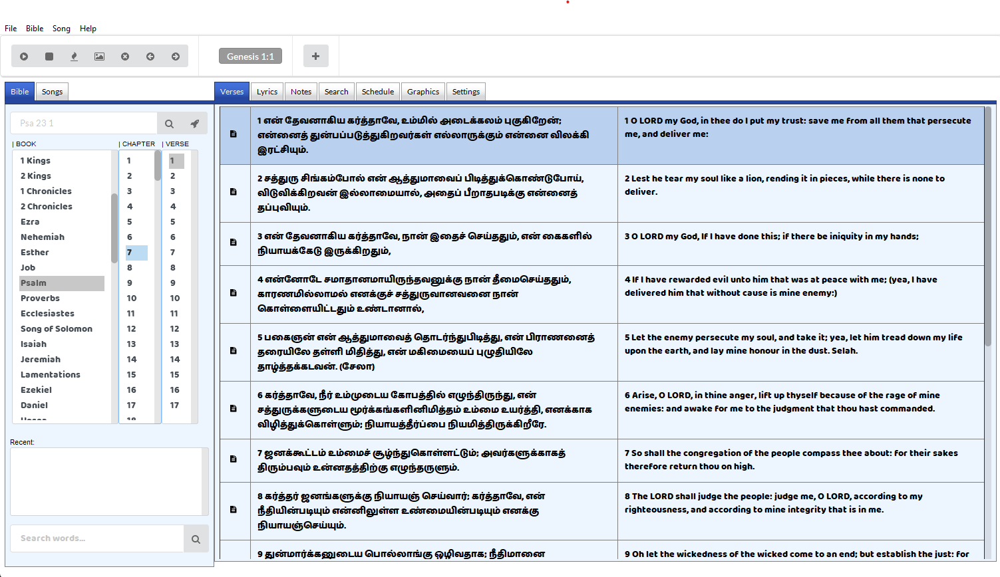
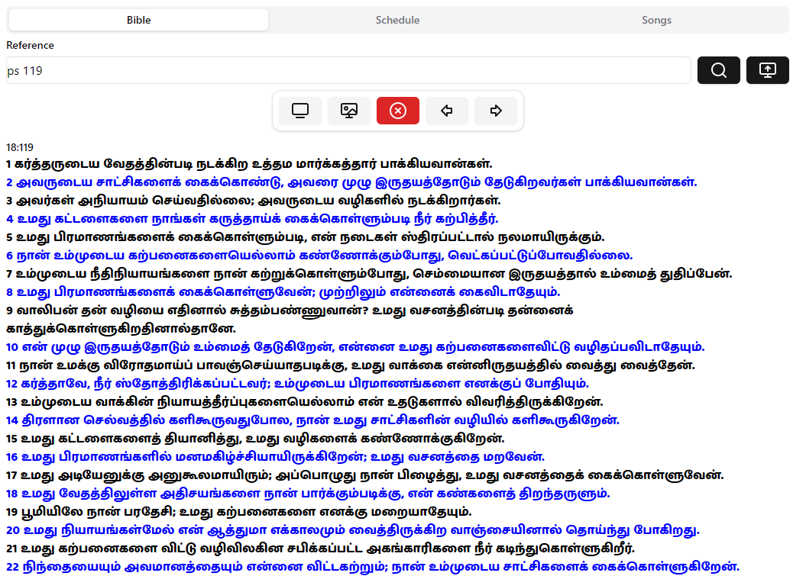

# 📖🎵 ReVerseVIEW: Bible & Lyric Presentation Software

## 🌟 Project Overview
ReVerseVIEW is a reborn open-source version of the popular legacy (Adobe AIR) VerseVIEW in a modest way possible

## ✨ Key Features
- **Biblical Text Library**: Comprehensive collection of biblical translations
- **Lyric Database**: Extensive collection of song lyrics across genres
- **Cross-Reference Engine**: Advanced search to find lyrical connections with scripture
- **Multilingual Support**: Translations for multiple languages
- **Offline Mode**: Access content without internet connection

## 🚀 Technologies Used
- **Frontend**: Vanilla JS + Preact (minimal)
- **Backend**: Some ActionScript 3 libraries

## 🔧 Installation
Releases are at [reverseview-releases](https://github.com/psyirius/reverseview-releases/releases)

### Prerequisites
- Node.js (v16+)
- npm or Yarn

### Setup
```bash
git clone https://github.com/yourusername/scripture-harmony.git
cd scripture-harmony
npm install
npm start
```

## 💡 How It Works
1. Search biblical passages
2. Discover related song lyrics
3. Explore thematic connections
4. Save favorite references

## 🤝 Contributing
Interested in contributing? Awesome!
- Fork the repository
- Create your feature branch (`git checkout -b feature/AmazingFeature`)
- Commit your changes (`git commit -m 'Add some AmazingFeature'`)
- Push to the branch (`git push origin feature/AmazingFeature`)
- Open a Pull Request

## 📸 Screenshots
### Main Screen


### Remote Control


## 📊 Project Status


## 📜 License
Distributed under the MIT License. See `LICENSE` for more information.

## 🙏 Acknowledgements
- Bible translations providers
- Music lyric databases
- Open-source community

---

**Made with ❤️ by S0m30n3**